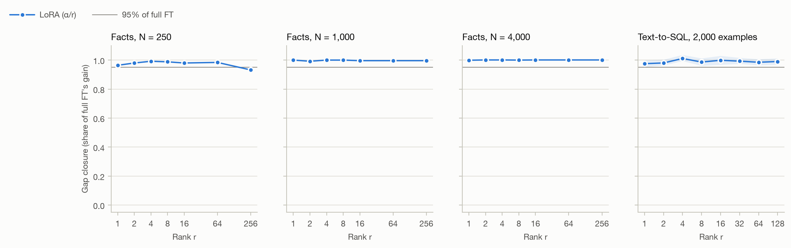

# Where LoRA stops matching full fine-tuning, and why

A controlled study of the LoRA rank threshold on a decoder-only model (Qwen3-0.6B-Base). The
question isn't *whether* LoRA is cheaper than full fine-tuning. It's **at what rank LoRA stops
matching full FT, what sets that rank, and whether the limit is capacity or optimization.**

> Status: the full pipeline (data, SQL scorer, training, oracle, grid runner, analysis, Kaggle runner)
> is built and checked end to end with a laptop smoke run. **No study results yet.** The GPU phases
> (LR calibration → main grids → oracle → ablations) run on Kaggle via
> [`notebooks/kaggle_runner.ipynb`](notebooks/kaggle_runner.ipynb). Results go here.

## Hypotheses

Gap closure: `G(r) = (score_r − score_base) / (score_FT − score_base)`. The threshold `r*` is the
smallest rank with G ≥ 0.95.

- **H1 (capacity):** `r*` depends on how much *new information* a task needs, not on the task's name.
  - Text-to-SQL (a skill/format task): `r*` ≤ 8.
  - Fact injection: `r*` grows ≥8× as the number of facts grows 16× (1k → 4k → 16k).
- **H2 (mechanism):** take the full-FT weight change `ΔW = W_FT − W_base`.
  - **(a)** The rank holding 90% of `‖ΔW‖²` predicts `r*` within 2×.
  - **(b) Oracle truncation:** evaluate `W_base + SVD_r(ΔW)` and compare it with a trained LoRA
    at the same rank. Three possible outcomes:
    - **Oracle ≈ LoRA:** the threshold is a real capacity limit.
    - **Oracle ≫ LoRA:** a rank-r solution exists but LoRA doesn't find it (optimization). rsLoRA
      is the test for that.
    - **LoRA ≫ oracle:** a compact rank-r solution exists that full FT didn't pick. The oracle is
      not an upper bound: in the laptop smoke test, LoRA r=4 scored 60% against the oracle's 4%
      ([log #9](docs/engineering_log.md)).

<!-- results:start -->
## Results

_Generated by `scripts/write_results.py` from the run registry. Minimum seeds per point: 1. Every verdict below is computed from the numbers._

| Hypothesis | Verdict | Evidence |
|---|---|---|
| H1, skill task (SQL) | **supported** | r* ≤ 1 (prediction: ≤ 8) |
| H1, knowledge task (facts) | **inconclusive** | LoRA reaches 95% of full FT at the smallest tested rank (1) for every N from 250 to 4,000: capacity never binds in the tested range, so growth can't be measured |
| H2a, energy rank predicts r* | **not tested** | needs full-FT spectra and a reached LoRA r* |

**H2b, oracle truncation vs trained LoRA:**

- not tested

**Resume bullet** (generated from the numbers above):

> Designed and ran a 55-run LoRA rank × data-size study on Qwen3-0.6B against full fine-tuning on free Kaggle T4s; found LoRA recovers ≥95% of full fine-tuning's gain at rank 1 (the smallest tested) on text-to-SQL and rank 1 (the smallest tested) for 4,000 injected facts.

### Thresholds

| Task | N | Base | Full FT | r* LoRA | r* LoRA (CI-strict) | r* oracle | 90%-energy rank of ΔW | Prediction / r* LoRA | Seeds |
|---|---|---|---|---|---|---|---|---|---|
| facts | 250 | 0.000 | 1.000 | 1 | 1 | — | — | — | 1 |
| facts | 1,000 | 0.000 | 1.000 | 1 | 1 | — | — | — | 1 |
| facts | 4,000 | 0.000 | 0.999 | 1 | 1 | — | — | — | 1 |
| sql | 2,000 | 0.318 | 0.859 | 1 | 1 | — | — | — | 3 |


<!-- results:end -->

## Design decisions (details in [`docs/engineering_log.md`](docs/engineering_log.md))

- **LR tuned per rank bucket, and rsLoRA as an ablation.** Standard α/r scaling changes update size
  with rank, so a naive sweep partly measures learning rate.
- **fp16 LoRA as the main sweep; QLoRA only as an ablation.** A 4-bit base would mix
  quantization error into the rank effect.
- **LoRA on all 7 linear projections; loss on answer tokens only.**
- **Held-out question templates** for facts evaluation, so it measures stored knowledge rather
  than recall of a memorized string.
- **An audited SQL execution matcher.** It started out accepting 9.9% of deliberately wrong
  queries; it now accepts 0.1% on scorable examples.

## Layout

```
src/lorathresh/
  data/facts.py     synthetic fictional-people world; N facts; train/eval templates don't overlap
  data/sql.py       sql-create-context loading, filtering of unscorable gold, deterministic splits
  sqlexec.py        execution match on random SQLite DBs with witness and near-miss rows
  train.py          one run: base | full | lora | qlora → registry
  eval.py           batched greedy generation + metrics
  oracle.py         per-layer SVD of ΔW, energy ranks, in-place rank-r truncation
  registry.py       append-only JSONL keyed by config hash (resumable)
  analysis.py       gap closure, bootstrap CIs, r*, energy prediction, figures (palette-validated)
scripts/
  run_grid.py       expand a YAML grid; FT-first ordering; --dry-run / --limit / --shard
  run_oracle.py     spectrum + oracle rank sweep for one full-FT checkpoint
  aggregate.py      registry → results/curves.csv, r_star.md, figures/*.png
  audit_sqlexec.py  false-positive audit of the SQL matcher on real gold queries
configs/            smoke, lr_cal, grid_facts, grid_sql, ablations  (94 unique runs)
docs/engineering_log.md
tests/              45 tests: data invariants, matcher, registry, oracle sanity, LoRA init/param count, analysis
```

## Quickstart (laptop)

```bash
python -m venv .venv && .venv/bin/pip install -e ".[dev,gpu]"
.venv/bin/pytest -q
.venv/bin/python scripts/run_grid.py configs/smoke.yaml --registry /tmp/smoke/runs.jsonl --output-dir /tmp/smoke/ckpt
```

## Kaggle runbook (2×T4)

**One command, unattended (batch kernel):** authenticate once, then submit. Your Kaggle account must
be phone-verified to use GPUs and internet in kernels.

```bash
kaggle auth login                               # OAuth in the browser; or put a token in ~/.kaggle/access_token
python scripts/kaggle_launch.py push lr_cal     # submit: 2×T4, internet on, private kernel
python scripts/kaggle_launch.py status lr_cal
python scripts/kaggle_launch.py pull lr_cal     # registry, logs, tables, figures → results/kaggle/lr_cal/
```

The kernel clones this repo, runs a full-FT memory check (and switches to micro-batching if it runs
out of memory), runs the grid on both GPUs with `scripts/run_parallel.py`, and leaves results in the
kernel output. `lr_cal` needs no Hugging Face token. The later grids save full-FT checkpoints for the
oracle, which exceed Kaggle's 20GB output limit, so pass `-- --push-repo <hf-user>/lorathresh-ckpts`
with an `HF_TOKEN` attached to the kernel.

**Easiest path: [`notebooks/kaggle_runner.ipynb`](notebooks/kaggle_runner.ipynb).** It covers setup,
the throughput and memory gate, launching both shards, progress checks, the oracle sweep, and
aggregation. The registry and checkpoints mirror to your private Hub repo, so every session resumes.
If full FT runs out of memory on a T4, add `--micro-batch-size 8`: same math, less memory. The manual steps:

1. New notebook → Accelerator **GPU T4 ×2**, Internet on. Add an `HF_TOKEN` secret with write
   access, and create a private model repo (e.g. `<you>/lorathresh-ckpts`) for checkpoints.
2. Setup cell:
   ```bash
   !git clone <this repo> && cd LoRA && pip install -q -e ".[gpu]"
   ```
3. **Gate before spending quota:** run one real config and check `train_tokens_per_second` and
   `eval_seconds` in `results/runs.jsonl`. If throughput is more than 30% below the plan's
   estimate (~40 T4-hours for the grid), shrink the grid first. The scope-down order is in the plan.
   ```bash
   !python -m lorathresh.train --task sql --n 2000 --method lora --rank 16 --lr 3e-4 --epochs 1 --n-eval 200
   ```
4. Run two shards in parallel, one per GPU:
   ```bash
   !CUDA_VISIBLE_DEVICES=0 nohup python scripts/run_grid.py configs/lr_cal.yaml --shard 0/2 --push-repo <you>/lorathresh-ckpts > shard0.log 2>&1 &
   !CUDA_VISIBLE_DEVICES=1 nohup python scripts/run_grid.py configs/lr_cal.yaml --shard 1/2 --push-repo <you>/lorathresh-ckpts > shard1.log 2>&1 &
   ```
   Both shards append to one `results/runs.jsonl`. Each line is a single small append, so writes
   don't interleave. Copy `results/runs.jsonl` somewhere persistent before the session ends.
   Re-launching skips finished runs.
5. Order: `lr_cal` → put the chosen LRs into `grid_*.yaml` → `grid_sql` and `grid_facts` →
   `run_oracle.py` for each full-FT run id → `ablations`.
6. At any point: `python scripts/aggregate.py` rebuilds `results/r_star.md` and `figures/` from
   whatever has finished. A setting shows up once it has a base run and a full-FT run.

## Prior work this builds on

- Hu et al. 2021, *LoRA*
- Aghajanyan et al. 2020, *Intrinsic Dimensionality Explains the Effectiveness of Language Model Fine-Tuning*
- Kalajdzievski 2023, *rsLoRA*
- Dettmers et al. 2023, *QLoRA*
- Biderman et al. 2024, *LoRA Learns Less and Forgets Less*
- Thinking Machines 2025, *LoRA Without Regret*

This project's contribution is the oracle-truncation diagnostic, which separates capacity from
optimization, and a controlled information axis (N facts), tested at a scale that fits on free compute.
